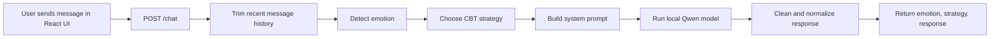
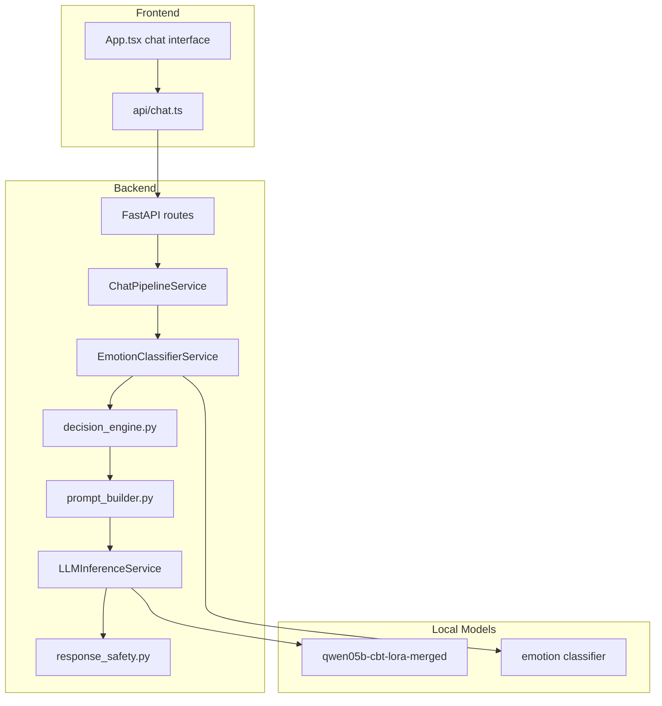

# Coach NLP

> Emotion-aware CBT chat assistant built with FastAPI, React, and local LLM inference.


## Overview

Coach NLP turns a notebook-based CBT pipeline into a product-style web app.

Instead of acting like a generic chatbot, the system analyzes the latest user message, detects the dominant emotion, selects a CBT strategy, builds a guided prompt, runs a local language model, and returns a structured response for the UI.

This repo is useful as both:

- a practical NLP product prototype
- a clean FastAPI + React portfolio project
- a strong base for future work in memory, safety, auth, and deployment

## Why This Project Stands Out

- Local-first inference: no external chat API is required for the main response flow.
- Emotion-aware orchestration: responses are shaped by detected emotion and CBT strategy selection.
- Product-oriented structure: backend services are separated by responsibility instead of staying trapped in notebooks.
- Clean frontend loop: the React app sends structured `messages[]` payloads and renders emotion + strategy metadata.
- Extendable architecture: memory, auth, stronger safety rules, and deployment can be added without rewriting the core pipeline.

## Request Flow



## Architecture



## Tech Stack

| Layer | Tools |
| --- | --- |
| Frontend | React 18, TypeScript, Vite, Vitest, Testing Library |
| Backend | FastAPI, Pydantic, Uvicorn, Pytest |
| NLP | Transformers, Torch |
| Modeling | Local Qwen fine-tuned artifacts + emotion classification |
| UX Goal | Calm, supportive CBT chat experience with structured outputs |

## Project Structure

```text
coach_nlp/
|-- backend/
|   |-- app/
|   |   |-- core/
|   |   |-- schemas/
|   |   `-- services/
|   |-- tests/
|   `-- requirements.txt
|-- frontend/
|   |-- public/
|   `-- src/
|-- models/
|   |-- qwen05b-cbt-lora/
|   |-- qwen05b-cbt-lora-adapter/
|   `-- qwen05b-cbt-lora-merged/
|-- notebooks/
|-- md_files/
`-- README.md
```

## Core Backend Output

The API is designed around a structured response contract:

```json
{
  "raw_emotion": "fear",
  "emotion": "anxiety",
  "strategy": "reassure_and_structure",
  "response": "It sounds like you're carrying a lot right now. What feels most uncertain?"
}
```

That contract is useful because the UI can display more than plain text. It can surface the detected emotional signal and the CBT strategy behind the answer.

## Quick Start

### 1. Prerequisites

- Python 3.11 recommended
- Node.js 18+
- npm
- Local model directory available at `models/qwen05b-cbt-lora-merged`

### 2. Run the backend

```bash
python3 -m venv .venv
source .venv/bin/activate
pip install -r backend/requirements.txt
cp backend/.env.example backend/.env
uvicorn backend.app.main:app --reload
```

Backend endpoints:

- `GET /healthz`
- `GET /readyz`
- `POST /chat`

### 3. Run the frontend

```bash
cd frontend
npm install
npm run dev
```

The Vite dev server proxies `/chat`, `/healthz`, and `/readyz` to `http://localhost:8000`.

## Example Request

```json
{
  "messages": [
    {
      "role": "user",
      "content": "I feel anxious about tomorrow."
    }
  ]
}
```

## Testing

Frontend:

```bash
cd frontend
npm test -- --run
```

Backend:

```bash
python3 -m pytest backend/tests/unit -q
```

## Current Status

- Frontend chat flow is implemented and tested.
- Backend API, orchestration services, and local model loading are implemented.
- The repo is structured like a production-style MVP, not a throwaway notebook demo.
- For backend work, prefer a fresh virtual environment instead of a global Python setup. Mixed NumPy / SciPy / sklearn installs can break `transformers` imports.

## Roadmap

- Add conversation memory
- Strengthen response safety and guardrails
- Add authentication and user sessions
- Add deployment and CI/CD
- Improve observability and model readiness diagnostics

## Why It Reads Well On GitHub And Upwork

- Clear product framing
- Clean architecture story
- Real technical stack
- Concrete run instructions
- Professional documentation with simple diagrams

## License

No license file is currently defined in this repository.
